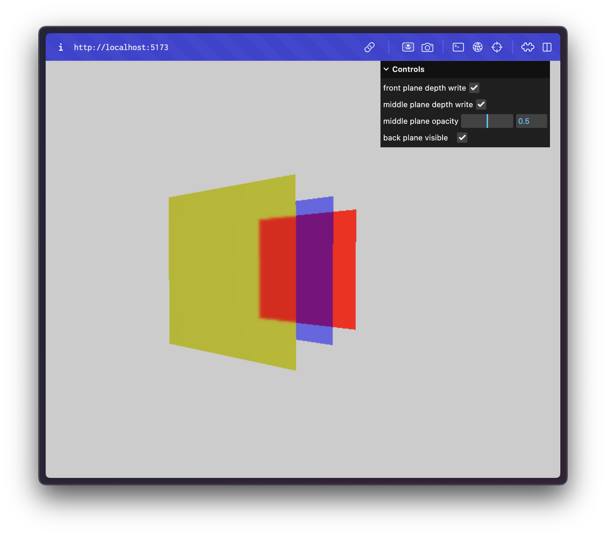
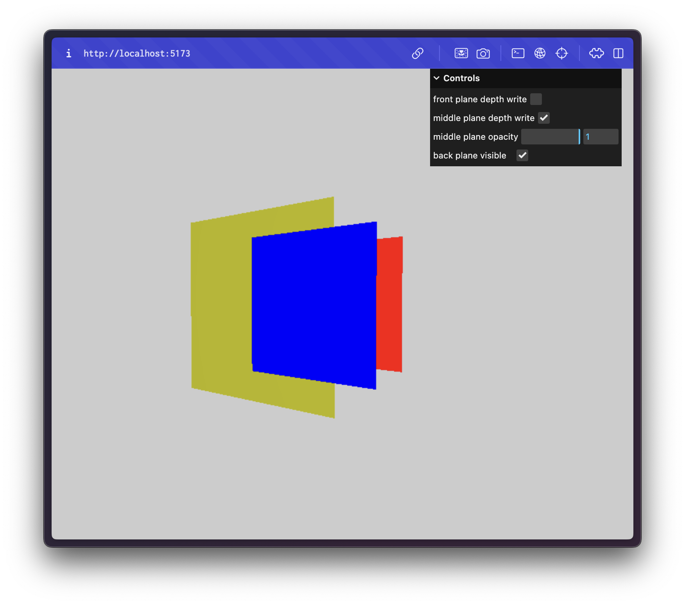

# Three.js Transparency Issue Example

This repository contains a minimal example that replicates a transparency issue in Three.js.

- With standard settings, looking through the yellow front plane, the opaque red plane in the background is visible, but the transparent blue plane in the middle is not.
  
- If `depthWrite` is disabled on the front plane, the blue plane appears as if it were in front of the yellow plane. (The opacity has been increased to 1 to highlight this issue).
  

## Setup

Download [Node.js](https://nodejs.org/en/download/).

Run the following commands:

```bash
# Install dependencies (only the first time)
npm install

# Run the local server at localhost:5173
npm run dev

# Build for production in the dist/ directory
npm run build
```
